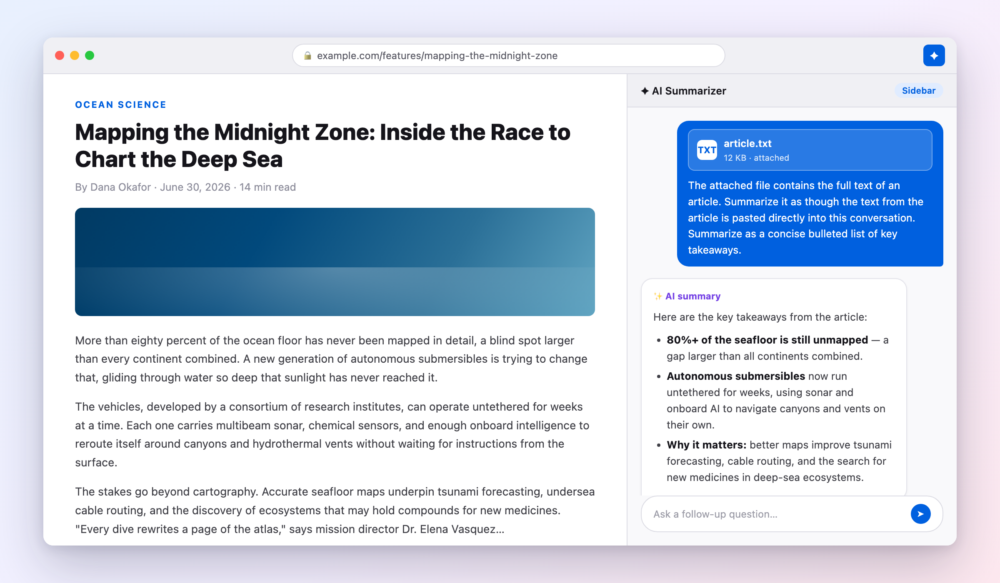
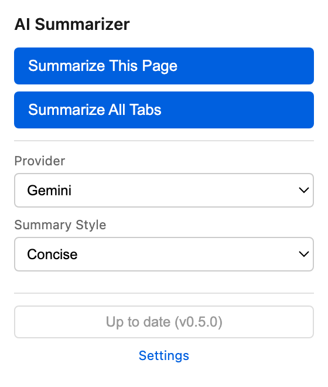
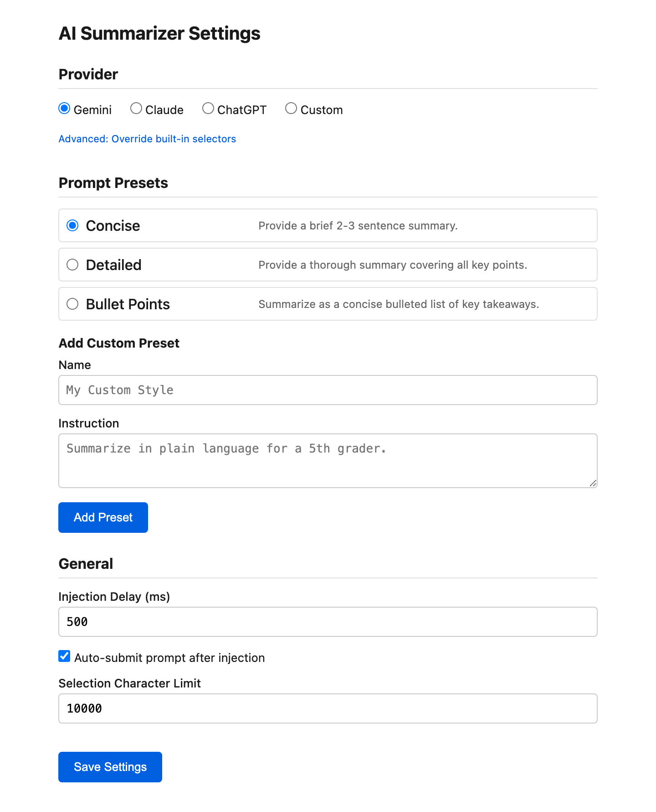

# AI Summarizer — Firefox Extension

Summarize web content in the Firefox sidebar using the LLM web UIs you already use — Gemini, Claude, ChatGPT, or any custom provider.

- **No API keys.** Uses your existing logged-in LLM sessions.
- **No accounts, no servers.** Everything runs locally in your browser.
- **No build step.** Plain JavaScript, Manifest V2.



## Install

**[⬇ Download the latest release (.xpi)](https://github.com/unknownbreaker/firefox-ai-summarizer/releases/latest/download/ai-summarizer.xpi)**

- Open the downloaded file with Firefox (or drag it onto a Firefox window) and confirm the install prompt.
- Note: stock release Firefox requires signed extensions. For unsigned builds, use Firefox Developer Edition or Nightly with `xpinstall.signatures.required` set to `false`.
- All versions: [Releases page](https://github.com/unknownbreaker/firefox-ai-summarizer/releases)

**Temporary (development):**

1. Open `about:debugging` → **This Firefox**
2. Click **Load Temporary Add-on…**
3. Select `manifest.json` from this project

## Features

- **Summarize the current page** — extracts the article text (Mozilla Readability) and attaches it to the LLM as a file, so the model reads the real content, not a URL guess.
- **Summarize a text selection** — highlight, right-click, done.
- **Summarize all open tabs** — every tab's article, extracted and bundled into one file.
- **Smart fallbacks** — if extraction or file upload fails: URL prompt → pasted text → clipboard. Something always gets through.
- **Prompt presets** — Concise, Detailed, Bullet Points, or your own custom instructions.
- **One-click updates** — the popup checks GitHub for a newer release and offers to install it.

## Screenshots

### Toolbar popup



### Settings



## Supported Providers

| Provider | URL | Notes |
|----------|-----|-------|
| Gemini | `gemini.google.com/app` | Default. Attaches articles via simulated drag-and-drop |
| Claude | `claude.ai/new` | |
| ChatGPT | `chat.openai.com` | |
| Custom | Any LLM web UI | Configure URL + CSS selectors in settings |

## Usage

**Current page:**

- Click the toolbar icon → **Summarize This Page**, or
- Right-click the page → **Summarize This Page**

**Selected text:**

- Highlight text → right-click → **Summarize Selection**

**All tabs:**

- Click the toolbar icon → **Summarize All Tabs**

In every case the sidebar opens with your LLM, the content is attached, and the prompt auto-submits. You're logged in already, so the summary just appears.

## Settings

Open via the **Settings** link in the popup, or Firefox's extension preferences.

- **Provider** — Gemini (default), Claude, ChatGPT, or custom (URL + input/submit/file-input CSS selectors).
- **Selector overrides** — fix built-in providers yourself if their DOM changes, no update needed.
- **Prompt presets** — pick a default; add custom presets with your own instructions.
- **Injection delay** — ms to wait before auto-submit (default 500).
- **Auto-submit** — turn off to review prompts before sending.
- **Selection character limit** — truncation point for selected-text prompts (default 10,000). Full-page article extraction is never truncated.

## How It Works

1. **Background script** extracts the article from the active tab (Readability.js), builds the prompt, and opens the sidebar.
2. **Sidebar** loads the LLM's real web UI directly via `sidebarAction.setPanel()` — no iframes.
3. **Injector content script** (runs only in the sidebar) attaches the article as a file, fills the chat input, and clicks send.
4. The LLM streams the summary in its own UI, in your own session.

If any step fails, the prompt falls back down the chain (file → URL → pasted text → clipboard) and you get a notification explaining what to do.

## Staying Updated

- A **"NEW" badge appears on the toolbar icon** when a newer release is available (checked every 6 hours in the background).
- The popup also checks the [latest GitHub release](https://github.com/unknownbreaker/firefox-ai-summarizer/releases/latest) each time it opens (cached 15 min).
- Newer version available → the **Install latest release** button activates; one click opens the new `.xpi`.
- Already current → no badge, and the button shows **Up to date** and stays disabled.

## Development

```sh
web-ext run              # Launch Firefox with the extension loaded
web-ext build            # Build the .xpi into web-ext-artifacts/
./release.sh --dry-run   # Preview a release (version bump, changelog)
./release.sh             # Tag, build, and publish a GitHub release
```

- Architecture details and invariants: [`CLAUDE.md`](CLAUDE.md) and [`docs/ARCHITECTURE.md`](docs/ARCHITECTURE.md)
- Manual test pages: `test/prompt-builder.test.html`, `test/providers.test.html`

## Known Limitations

- **LLM sites change their DOM.** If injection breaks, update the selector overrides in settings (and please file an issue).
- **You must be logged in** to the provider — the extension drives the site's own UI.
- **URL-fallback prompts need a browsing-capable model.** Only relevant when article extraction fails and the URL prompt is used.
